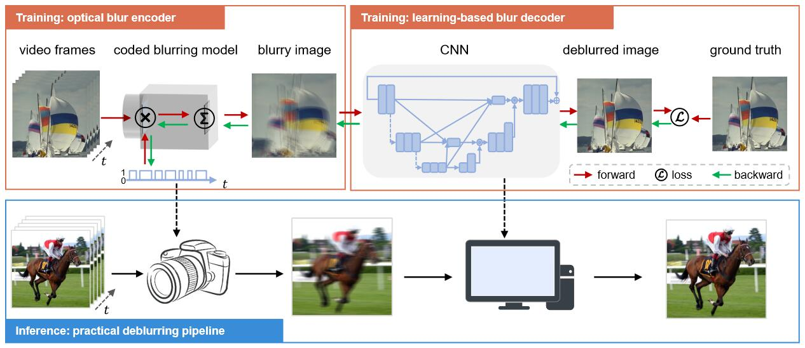

# Deep coded exposure

[This repository](https://github.com/zhihongz/DCE) contains the PyTorch code for [our paper](https://doi.org/10.1364/PRJ.489989) "Deep coded exposure: end-to-end co-optimization of flutter shutter and deblurring processing for general motion blur removal" by [Zhihong Zhang](https://zhihongz.github.io/), Kaiming Dong, Jinli Suo, and Qionghai Dai.

 
## Introduction
We proposed an end-to-end framework to handle general motion blurs with a unified deep neural network, and optimize the shutter’s encoding pattern together with the deblurring processing to achieve high-quality sharp images. The framework incorporates a learnable flutter shutter sequence to capture coded exposure snapshots and a learning-based deblurring network to restore the sharp images from the blurry inputs. By co-optimizing the encoding and the deblurring modules jointly, our approach avoids exhaustively searching for encoding sequences and achieves an optimal overall deblurring performance.



## Requirements

```
torch>=1.1
torchvision
numpy
hydra-core>=1.0.3
hydra_colorlog
omegaconf
tqdm
tensorboard>=1.14
matplotlib
opencv
scikit-image
```

> Please refer to [requirements.txt](requirements.txt) for details

## How to run 
1. Configurate your conda environment according to the requirements above.
2. Run `python test.py` for a quick demonstration on the pre-trained model.
3. Your can change the configuration files in `conf/` for further testing or training.


## Citation   
```
@article{zhang2023DeepCoded,
  title = {Deep coded exposure: end-to-end co-optimization of flutter shutter and deblurring processing for general motion blur removal},
  shorttitle = {Deep coded exposure},
  author = {Zhang, Zhihong and Dong, Kaiming and Suo, Jinli and Dai, Qionghai},
  year = {2023},
  journal = {Photon. Res.},
  volume = {11},
  number = {10},
  pages = {1678}
  doi={10.1364/PRJ.489989}
}
```
## Acknowledgement

The implementation of DCE is based on [DeepRFT](https://github.com/INVOKERer/DeepRFT). We thank the authors for their open-source spirit.
